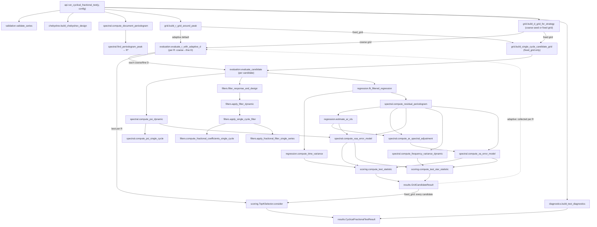
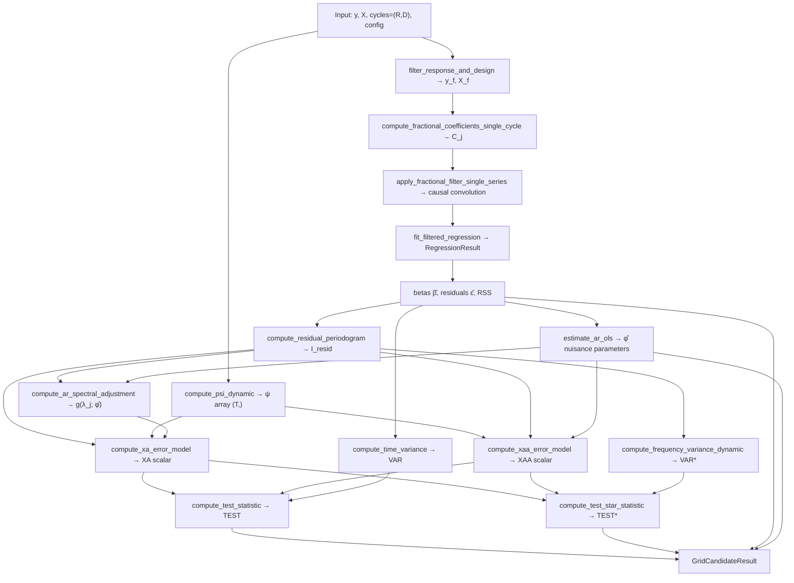
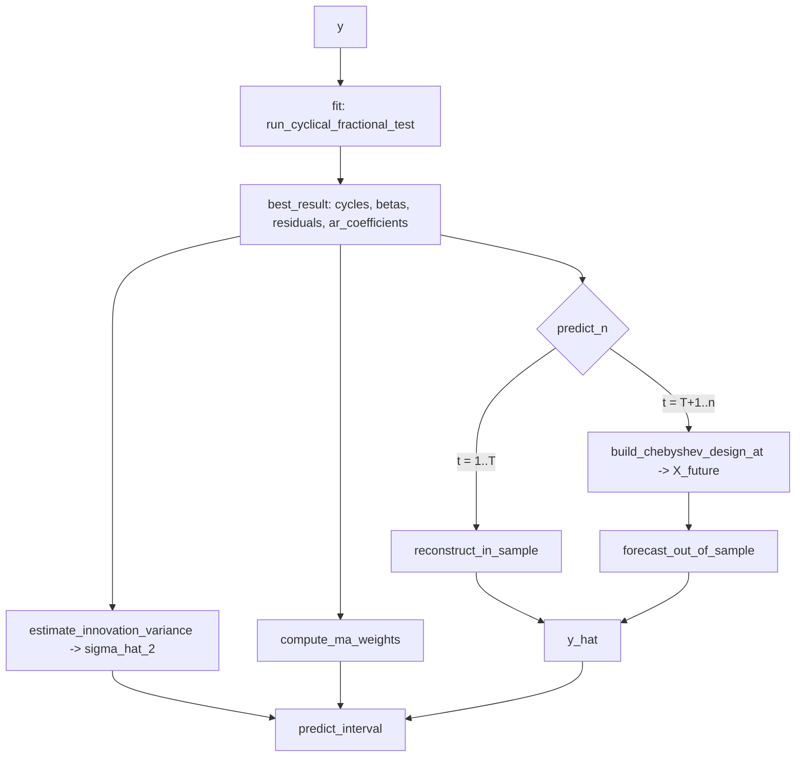

# Data Flow Diagram

This document shows how data flows through `cyclical_fractional_test` from the raw input series to the final ranked result.

---

## 1. Overview

The computation begins with `y = Y(t)` and ends with `CyclicalFractionalTestResult`, which contains:

- `best_result` — the single best `GridCandidateResult` (smallest |TEST| or |TEST*|).
- `top_k_results` — the k best candidates, ordered by score ascending.
- Per-candidate `error_model` and estimated AR nuisance coefficients.
- `diagnostics` — a `TestDiagnostics` object with run metadata.

---

## 2. Global pipeline diagram

---

## 3. Per-candidate pipeline diagram

This diagram focuses on what happens inside `evaluate_candidate` for a single `(R, D)` pair.

---

## 4. File responsibilities

| File | Responsibility | Main functions | Primary input | Primary output |
|---|---|---|---|---|
| `api.py` | Orchestrate the full pipeline | `run_cyclical_fractional_test` | `y`, `config` | `CyclicalFractionalTestResult` |
| `validation.py` | Input validation | `validate_series`, `validate_config` | raw `y`, `config` | clean `np.ndarray`, `CyclicalTestConfig` |
| `chebyshev.py` | Deterministic basis | `build_chebyshev_design` | `T`, `n_cycles` | `(T, m)` design matrix |
| `spectral.py` | Periodogram, ψ, XAA, VAR*, XA, AR weighting | `compute_document_periodogram`, `compute_psi_single_cycle`, `compute_xaa_error_model`, `compute_ar_spectral_adjustment`, `compute_xa_error_model`, `compute_frequency_variance_dynamic` | `y` or `residuals` | `I_y`, `ψ`, `g`, `XAA`, `VAR*`, `XA` |
| `grid.py` | Candidate grids (fixed + adaptive coarse/fine D) | `build_r_grid_around_peak`, `build_d_grid`, `build_default_d_coarse_grid`, `build_d_fine_grid`, `build_d_grid_for_strategy`, `build_single_cycle_candidate_grid` | `r_peak`, `r_window`, `config` | arrays of `R`, `D`, `(StochasticCycle,)` tuples |
| `filters.py` | Fractional cyclic filter | `compute_fractional_coefficients_single_cycle`, `apply_fractional_filter_single_series`, `filter_response_and_design` | `y`, `X`, `cycles` | `y_filtered`, `X_filtered` |
| `regression.py` | Deterministic and residual AR OLS regressions | `fit_filtered_regression`, `compute_time_variance`, `estimate_ar_ols` | `y_f`, `X_f`, `residuals` | `RegressionResult`, `VAR`, AR nuisance coefficients |
| `scoring.py` | TEST / TEST*, ranking | `compute_test_statistic`, `compute_test_star_statistic`, `score_candidate`, `TopKSelector` | `T`, `XA`, `XAA`, `VAR` or `VAR*` | `TEST`, `TEST*`, ranked candidates |
| `evaluation.py` | Per-candidate orchestration; per-R adaptive D search | `evaluate_candidate`, `evaluate_r_with_adaptive_d` | `y`, `X`, `cycles`/`R`, `config` | `GridCandidateResult`, `AdaptiveDSearchResult` |
| `diagnostics.py` | Run-level diagnostics | `summarize_periodogram`, `compare_variance_definitions`, `build_test_diagnostics` | counters, `I_y`, `config` | `TestDiagnostics` |
| `results.py` | Data containers | `StochasticCycle`, `GridCandidateResult`, `AdaptiveDSearchResult`, `CyclicalFractionalTestResult` | — | dataclass instances |
| `config.py` | Configuration | `CyclicalTestConfig` | — | dataclass instance |
| `exceptions.py` | Error hierarchy | `InvalidSeriesError`, `InvalidConfigurationError`, `InvalidCycleError` | — | exception classes |

---

## 5. Data objects

| Object | Created in | Contains | Passed to |
|---|---|---|---|
| `y` (np.ndarray) | user / `validate_series` | raw time series T floats | `compute_document_periodogram`, `evaluate_candidate` |
| `X` (np.ndarray) | `build_chebyshev_design` | (T, m) Chebyshev design matrix | `evaluate_candidate`, `filter_response_and_design` |
| `lambdas_y` (np.ndarray) | `compute_document_periodogram` | λ_j = 2πj/T, shape (T,) | `build_test_diagnostics` |
| `I_y` (np.ndarray) | `compute_document_periodogram` | periodogram values shape (T,) | `find_periodogram_peak`, `build_test_diagnostics` |
| `r_peak` (int) | `find_periodogram_peak` | argmax of I_y; j=0 only when zero frequency is enabled | `build_r_grid_around_peak`, `TestDiagnostics` |
| `r_candidates` (np.ndarray) | `build_r_grid_around_peak` | integer R values around R*, optionally including 0 | `build_single_cycle_candidate_grid` |
| `d_grid` (np.ndarray) | `build_d_grid_for_strategy` | D values in [0,1] (fixed grid, or coarse seed for adaptive) | `build_single_cycle_candidate_grid`, `evaluate_r_with_adaptive_d` |
| `cycles` (tuple) | `build_single_cycle_candidate_grid` / `evaluate_r_with_adaptive_d` | `(StochasticCycle(R, D),)` | `evaluate_candidate` |
| `AdaptiveDSearchResult` | `evaluate_r_with_adaptive_d` | best/coarse result, best D, coarse/fine counts for one R | `TopKSelector.consider`, diagnostics |
| `y_filtered` (np.ndarray) | `filter_response_and_design` | fractionally filtered series (T,) | `fit_filtered_regression` |
| `X_filtered` (np.ndarray) | `filter_response_and_design` | fractionally filtered design (T, m) | `fit_filtered_regression` |
| `RegressionResult` | `fit_filtered_regression` | `betas`, `residuals`, `RSS`, `rank`, `cond` | `compute_time_variance`, `compute_residual_periodogram` |
| `residuals` (np.ndarray) | `RegressionResult.residuals` | ε̂ = y_f − X_f β̂, shape (T,) | `compute_residual_periodogram`, `compute_time_variance` |
| `I_residuals` (np.ndarray) | `compute_residual_periodogram` | periodogram of ε̂, shape (T,) | `compute_frequency_variance_dynamic`, `compute_xa_error_model` |
| `ar_coefficients` (np.ndarray) | `estimate_ar_ols` | zero, one, or two estimated AR nuisance parameters | `compute_ar_spectral_adjustment`, `compute_xaa_error_model`, `GridCandidateResult` |
| `ar_spectral_adjustment` (np.ndarray) | `compute_ar_spectral_adjustment` | g(λ_j; φ̂), shape (T,) | `compute_xa_error_model` |
| `GridCandidateResult` | `evaluate_candidate` | all statistics for one (R,D) | `TopKSelector.consider` |
| `TopKSelector` | `api.run_cyclical_fractional_test` | sorted heap of k best candidates | `get_top_k()`, `get_best()` |
| `TestDiagnostics` | `build_test_diagnostics` | counters, periodogram summary, mode info | `CyclicalFractionalTestResult.diagnostics` |
| `CyclicalFractionalTestResult` | `api.run_cyclical_fractional_test` | `best_result`, `top_k_results`, `diagnostics`, `r_peak`, `r_candidates`, `d_grid`, `config` | returned to caller |

---

## 6. Dispatcher architecture

The following dispatcher functions select the correct single- or multi-cycle implementation based on the `mode` / `stochastic_cycle_mode` argument:

| Dispatcher | Single-cycle path | Multi-cycle path |
|---|---|---|
| `compute_psi_dynamic` | `compute_psi_single_cycle` | `compute_psi_multi_cycle` ✅ aggregate ψ |
| `compute_xaa_dynamic` | `compute_xaa_single_cycle` | `compute_xaa_multi_cycle` ✅ scalar XAA |
| `apply_filter_dynamic` | `apply_single_cycle_filter` | `apply_multi_cycle_filter` ✅ sequential |
| `compute_frequency_variance_dynamic` | `compute_frequency_variance_single_cycle` | `compute_frequency_variance_multi_cycle` ✅ implemented |
| `compute_xa_dynamic` | `compute_xa_single_cycle` | `compute_xa_multi_cycle` ✅ scalar XA |

**Legend:** ✅ = numerically implemented; ⚠️ = intentionally unavailable path, if shown.

The mode `"multi_peak_single_cycle"` always routes to the single-cycle path at the per-candidate level — multiple peaks are handled by the grid, not by the dispatcher.

Wave 16 adds error-model dispatchers. The residual error model and
`stochastic_cycle_mode` are independent axes:

| Dispatcher | White-noise path | AR(1) path | AR(2) path |
|---|---|---|---|
| `compute_xaa_error_model` | `compute_xaa_dynamic` | `compute_xaa_ar1_dynamic` | `compute_xaa_ar2_dynamic` |
| `compute_xa_error_model` | `compute_xa_dynamic` | `compute_xa_ar1_dynamic` | `compute_xa_ar2_dynamic` |

Each AR dispatcher then selects a cycle-mode implementation:

| Dispatcher | Single-cycle path | Multi-cycle path |
|---|---|---|
| `compute_xaa_ar1_dynamic` | `compute_xaa_ar1_single_cycle` | `compute_xaa_ar1_multi_cycle` ✅ implemented |
| `compute_xaa_ar2_dynamic` | `compute_xaa_ar2_single_cycle` | `compute_xaa_ar2_multi_cycle` ✅ implemented |
| `compute_xa_ar1_dynamic` | `compute_xa_ar1_single_cycle` | `compute_xa_ar1_multi_cycle` ✅ implemented |
| `compute_xa_ar2_dynamic` | `compute_xa_ar2_single_cycle` | `compute_xa_ar2_multi_cycle` ✅ implemented |

---

## Prediction pipeline (Wave 18)

`CyclicalFractionalModel` wraps the test and reuses the fitted objects for
reconstruction and forecasting. The math lives in `prediction.py`.

The in-sample branch is the one-step conditional mean, with the exact identity
`y_t − ŷ_t = e_t` (AR innovation). The forecast branch propagates the AR error
forecast through the inverted cyclic filter and adds the extrapolated Chebyshev
trend (training length `T_ref` held fixed).
